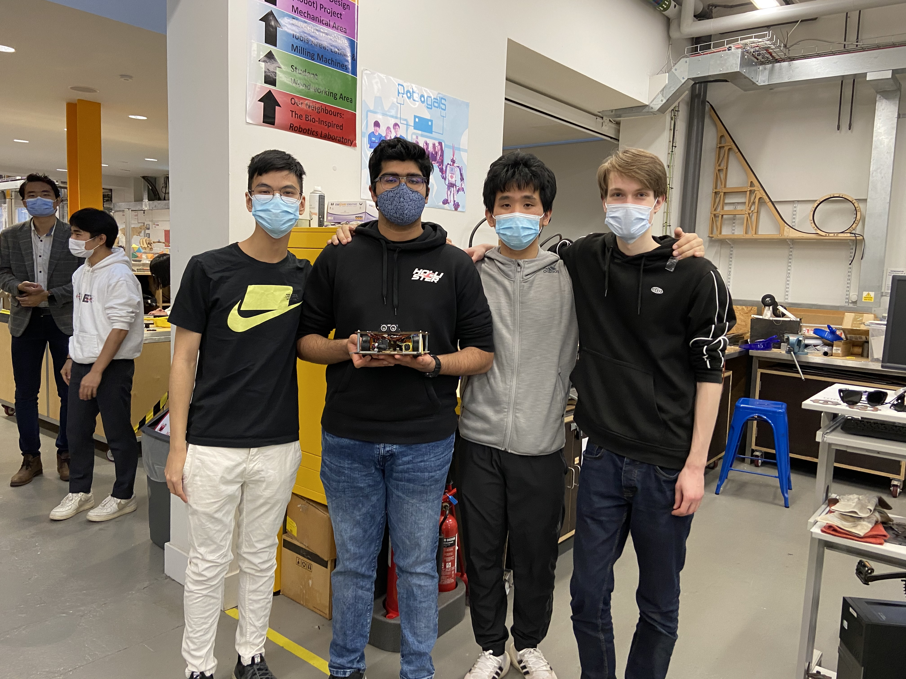
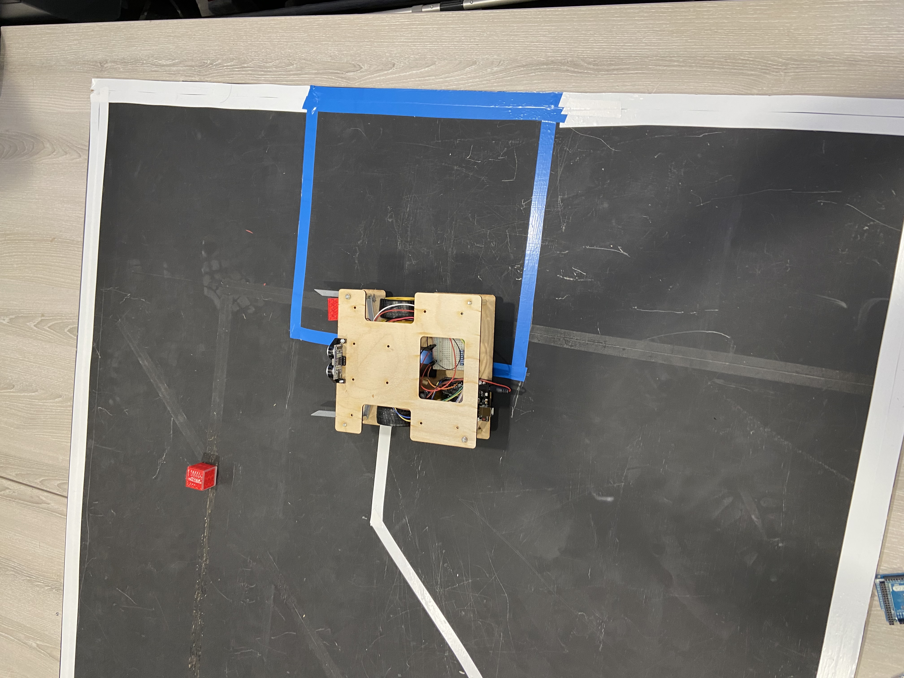

### Cambridge University Robotics Minibots Competition 2021
This repository contains
- CAD files for the physical design of the minibot
- Arduino code for the minibot (a cleaned-up version is also provided where redundant code is removed)

My team of 4 - Benson (left), Dhruv, Maxwell, Greg (right)

Our minibot collecting 1 block

A short clip of our robot (left) in action, collecting 3 blocks
https://www.youtube.com/watch?v=C1ky-vsdD8U